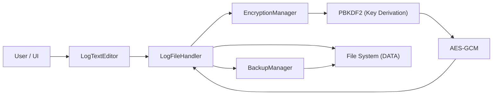
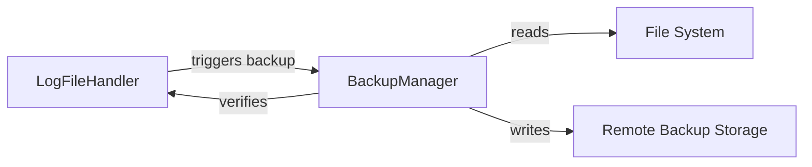
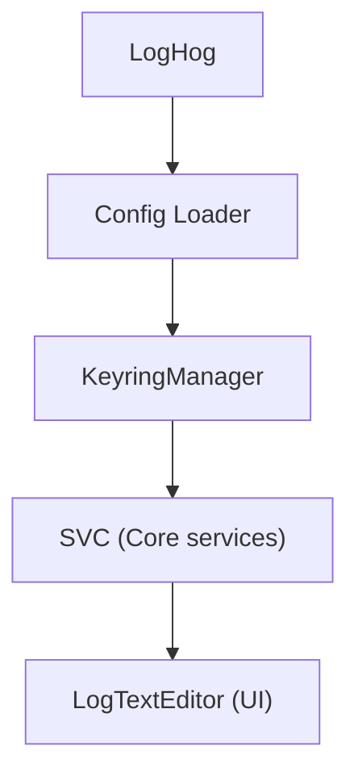
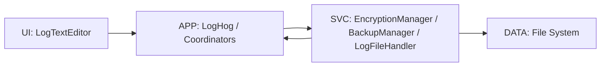

# .LOG-hog Architecture Documentation

**Version:** 2.0\
**Last Updated:** April 2026\
**Author:** Johan Andersson

***

## System Overview


### Layers

* UI: Swing interface
* APP: Application coordination
* SVC: Core services
* DATA: File system

***

## Core Components


### Components

* `LogHog`: entry point
* `LogTextEditor`: main window
* `LogFileHandler`: file operations
* `EncryptionManager`: crypto operations
* `BackupManager`: backups

***

## Encryption Flow



***

## Backup Flow



***

## Startup Flow



***

## Password Handling

* Progressive delays after failed attempts
* Limited retries
* Raw password not retained after unlock
* Restart required after limit

***

## Project Structure

```
src/
├── main/
├── encryption/
├── filehandling/
├── gui/
├── clipboard/
├── utils/
└── resources/
```

***

## Design Patterns

* Singleton
* Factory
* Observer
* Facade

***

## Technology Stack

| Area     | Technology |
| -------- | ---------- |
| Language | Java 17    |
| UI       | Swing      |
| Crypto   | JDK        |
| Build    | javac      |

***

## Security Considerations

* Protects data at rest
* No protection against malware
* Memory exposure reduced, but still possible during active session
* Secure deletion is best-effort

***

## Data Flow



***

## Performance

* Fast startup
* Low memory use
* Depends on file size

***

## Glossary

* AES: encryption
* GCM: integrity + encryption
* PBKDF2: key derivation
* IV: initialization vector
* Salt: random input

***

## Documentation

* encryption.md
* help.md
* README.md

***

*Architecture document v2.0 – April 2026*
