# .LOG-hog Architecture Documentation

**Version:** 2.0  
**Last Updated:** April 2026  
**Author:** Johan Andersson

---

## 📖 Quick Start for New Developers

Welcome! This document explains how .LOG-hog is built. If you're new to coding, here's what you need to know:

- **.LOG-hog** is a **desktop app** for writing secure, timestamped notes
- It's written in **Java** (a popular programming language)
- It uses **AES-256 encryption** (the same security used by governments and banks)
- It has **zero external dependencies** - everything is built with standard Java

### What is "Architecture"?

Think of architecture like a building blueprint. It shows:
- **What parts exist** (like rooms in a house)
- **How they connect** (like hallways between rooms)
- **What each part does** (like "this is the kitchen")

---

## 🏠 The Big Picture

.LOG-hog is organized in **layers**, like a cake. Each layer has a specific job:

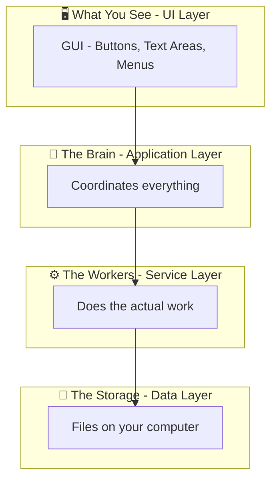

**Why layers?** Each layer only talks to the layer below it. This makes the code:
- ✅ Easier to understand (one thing at a time)
- ✅ Easier to fix (problems are isolated)
- ✅ Easier to test (test each layer separately)

---

## 🧩 Main Components

Here are the most important parts of .LOG-hog and what they do:

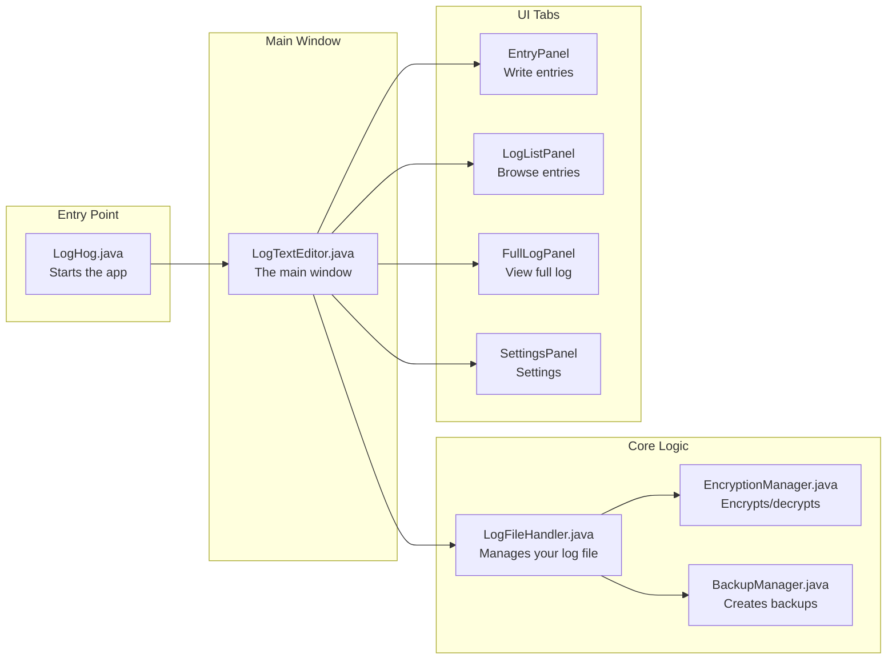

### What Each Part Does (Simple Explanation)

| Component | What it does | Real-world analogy |
|-----------|-------------|-------------------|
| **LogHog.java** | Starts the application | The "ON" button |
| **LogTextEditor.java** | The main window with tabs | A tabbed notebook |
| **LogFileHandler.java** | Reads/writes your log file | A librarian who finds and stores books |
| **EncryptionManager.java** | Scrambles data so only you can read it | A safe with a combination lock |
| **BackupManager.java** | Creates safety copies | A photocopy machine |
| **EntryPanel** | Where you type new entries | A blank page in your diary |
| **LogListPanel** | Shows all your entries in a list | The table of contents |
| **FullLogPanel** | Shows your entire log | Reading the whole book |
| **SettingsPanel** | Change how the app works | Control panel |

---

## 🔐 How Encryption Works

Encryption is how we keep your data secret. Here's the process:

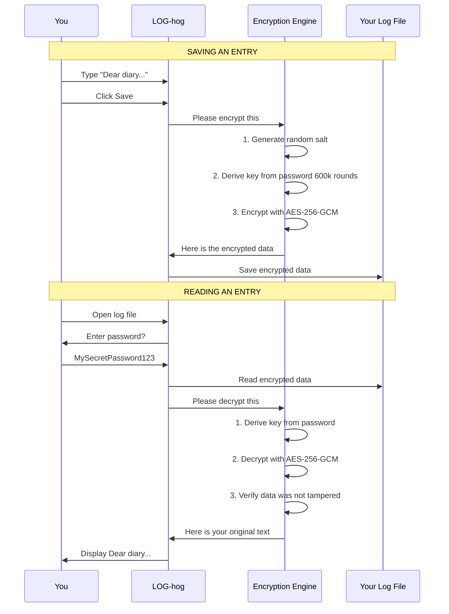

### Encryption Terms Explained

| Term | What it means | Why it matters |
|------|--------------|----------------|
| **AES-256** | Advanced Encryption Standard with 256-bit key | Military-grade security, NSA approved |
| **GCM** | Galois/Counter Mode | Detects if someone tampered with your data |
| **PBKDF2** | Password-Based Key Derivation Function 2 | Makes password cracking very slow |
| **600,000 iterations** | How many times we process your password | Takes centuries to brute-force |
| **Salt** | Random data added to your password | Same password = different encryption each time |
| **IV** | Initialization Vector | Random starting point for encryption |

---

## 💾 How Backups Work

.LOG-hog automatically protects against data loss with a 6-layer backup system:

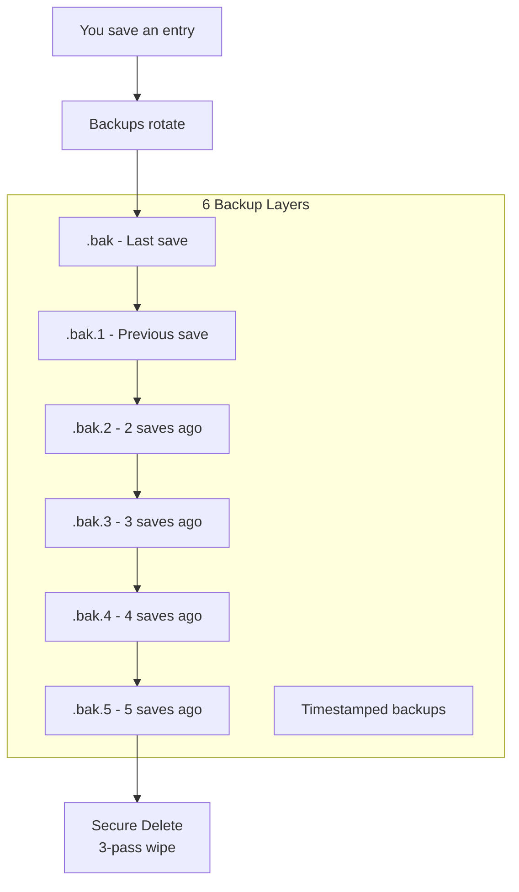

### Secure Deletion (3-Pass Wipe)

When old backups are deleted, we **securely erase** them:

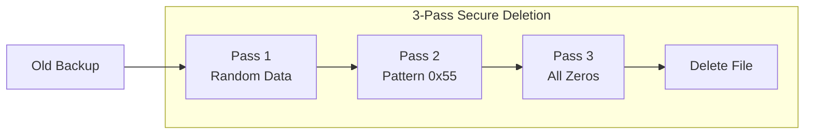

| Pass | What's Written | Why |
|------|---------------|-----|
| 1 | Random bytes (SecureRandom) | Obscures the original data |
| 2 | 0x55 (01010101 binary) | Breaks up patterns |
| 3 | 0x00 (zeros) | Final clean wipe |

> ⚠️ **SSD Note:** On solid-state drives, this isn't 100% effective due to wear-leveling. Use full-disk encryption (BitLocker/FileVault/LUKS) for maximum SSD security.

---

## 🚀 Application Startup Flow

What happens when you launch .LOG-hog:

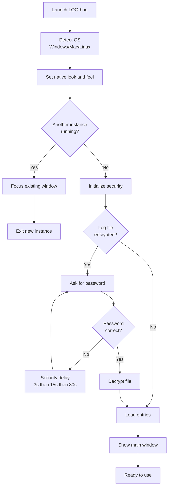

---

## 🔒 Password Security System

.LOG-hog protects against password guessing with progressive delays:

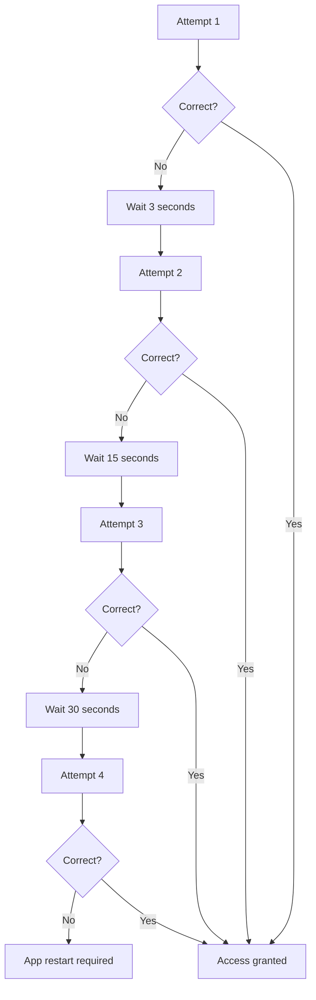

**Why progressive delays?**
- Attempt 1: 3 seconds → Allows fixing typos
- Attempt 2: 15 seconds → Slows down guessing
- Attempt 3: 30 seconds → Automated attacks become impractical
- Attempt 4+: App restart required → Completely stops scripts

---

## 📦 Package Structure

Here's how the code is organized:

```
src/
├── LogHog.java                 ← App entry point
│
├── main/                       ← Core application
│   ├── LogTextEditor.java      ← Main window
│   ├── BackupManager.java      ← Backup system
│   ├── SecureDeletionUtils.java← 3-pass file wipe
│   ├── SingleInstanceManager.java ← Prevent duplicate instances
│   └── ...
│
├── encryption/                 ← Security
│   ├── EncryptionManager.java  ← AES-256-GCM
│   ├── Encryptor.java          ← Interface
│   └── FileEncryptionManager.java
│
├── filehandling/               ← File operations
│   ├── LogFileHandler.java     ← Read/write logs
│   ├── EntryLoader.java        ← Parse entries
│   └── LogParser.java          ← Timestamp parsing (23+ formats)
│
├── gui/                        ← User interface
│   ├── EntryPanel.java         ← Write entries tab
│   ├── LogListPanel.java       ← Entry list tab
│   ├── FullLogPanel.java       ← Full log view tab
│   ├── SettingsPanel.java      ← Settings tab
│   ├── PasswordDialog.java     ← Password prompts
│   └── ...
│
├── clipboard/                  ← Clipboard security
│   ├── ClipboardHandler.java
│   └── SecureClipboardManager.java ← Auto-clear clipboard
│
├── security/                   ← Security utilities
│   └── SecureTempFiles.java    ← Secure temp file creation
│
├── utils/                      ← Helpers
│   ├── DateHandler.java        ← Date/time formatting
│   ├── CryptoUtils.java        ← Memory zeroization
│   └── ...
│
└── resources/                  ← Static files
    ├── help.md
    └── dict.txt                ← EFF Diceware wordlist
```

---

## 🎯 Design Patterns Used

Design patterns are proven solutions to common programming problems:

### 1. Singleton Pattern
**Problem:** We need exactly ONE instance of something  
**Solution:** Create it once, reuse everywhere

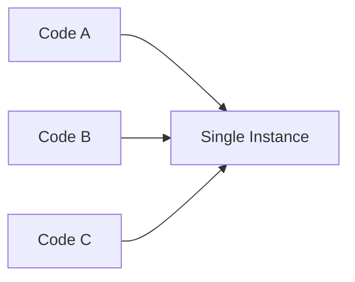

**Used in:** `ServiceFactory`, `SingleInstanceManager`

### 2. Factory Pattern  
**Problem:** Creating objects is complex  
**Solution:** Have a "factory" create them for you

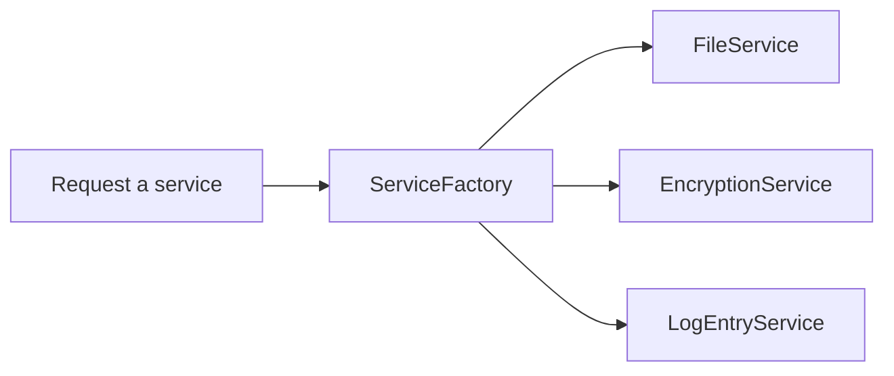

### 3. Observer Pattern
**Problem:** One thing changes, others need to know  
**Solution:** "Subscribe" to updates

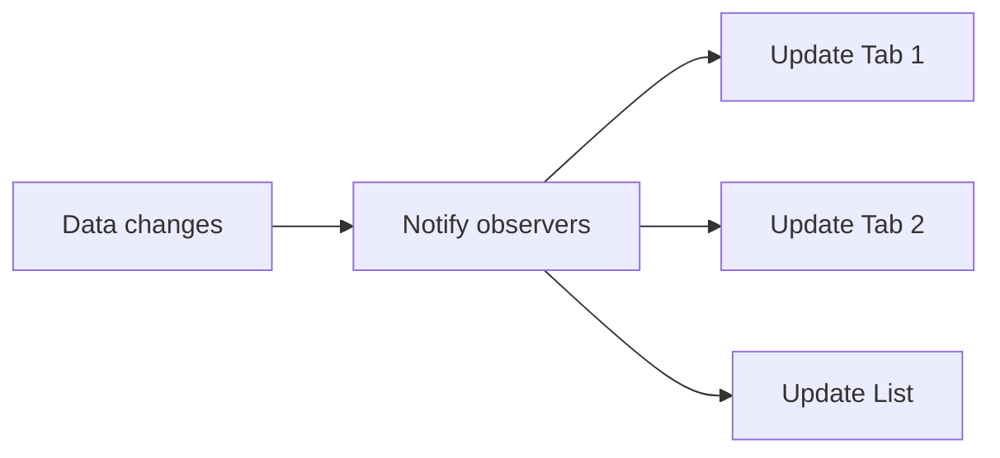

### 4. Facade Pattern
**Problem:** Complex system with many parts  
**Solution:** Simple interface hides complexity

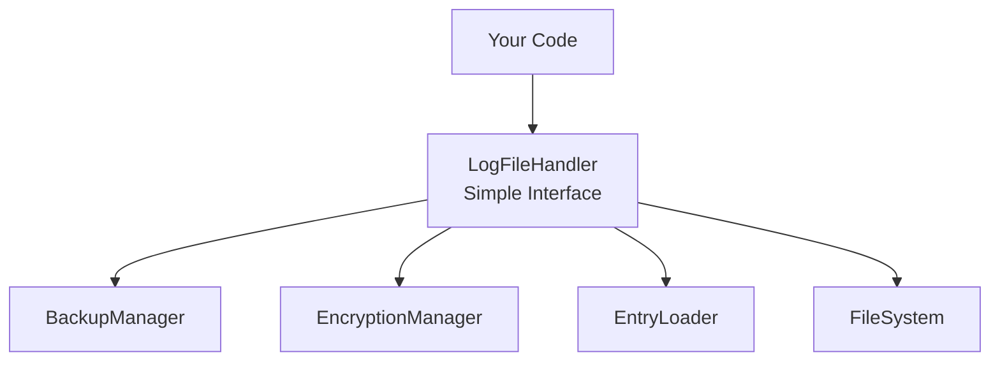

---

## 🔧 Technology Stack

| Component | Technology | Why we chose it |
|-----------|------------|-----------------|
| Language | Java 17 | Cross-platform, secure, mature |
| UI | Swing | Built into Java, no downloads needed |
| Encryption | JDK Crypto | Audited, government-approved |
| Build | javac/jar | Simple, no build tools required |
| Dependencies | **ZERO** | Smaller, more secure, maintainable |

### Zero-Dependency Benefits

| App Type | Typical Size | Notes |
|----------|-------------|-------|
| **.LOG-hog** | **230 KB** | Pure JDK, zero dependencies |
| JavaFX App | 5-20 MB | JavaFX + libraries |
| Electron App | 100-200 MB | Bundles Chrome browser |

**Why zero dependencies matter:**
- ✅ No supply chain attacks (malicious libraries)
- ✅ No version conflicts
- ✅ No dependency updates to track
- ✅ Sub-second startup time
- ✅ ~25 MB memory usage (vs 100-500 MB for Electron)

---

## 🛡️ Security Architecture

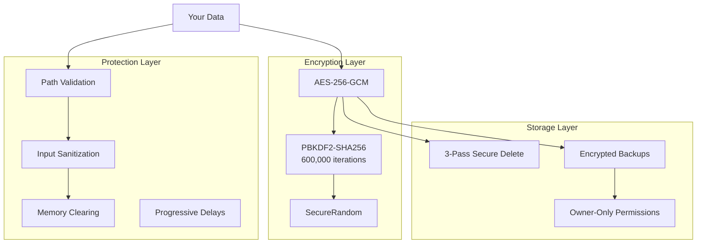

### Security Checklist

| Feature | Status | Description |
|---------|--------|-------------|
| Encryption | ✅ | AES-256-GCM (military grade) |
| Key Derivation | ✅ | PBKDF2 with 600,000 iterations |
| Memory Safety | ✅ | Passwords zeroed immediately after use |
| Secure Deletion | ✅ | 3-pass wipe (random, 0x55, zeros) |
| Path Traversal | ✅ | Blocked (no `../` attacks) |
| Input Validation | ✅ | All inputs sanitized |
| Brute Force | ✅ | Progressive delays + lockout |
| Single Instance | ✅ | FileLock prevents conflicts |
| File Permissions | ✅ | Owner-only on encrypted files |
| No Serialization | ✅ | Eliminates deserialization attacks |

---

## 📊 Data Flow

How data moves through the application:

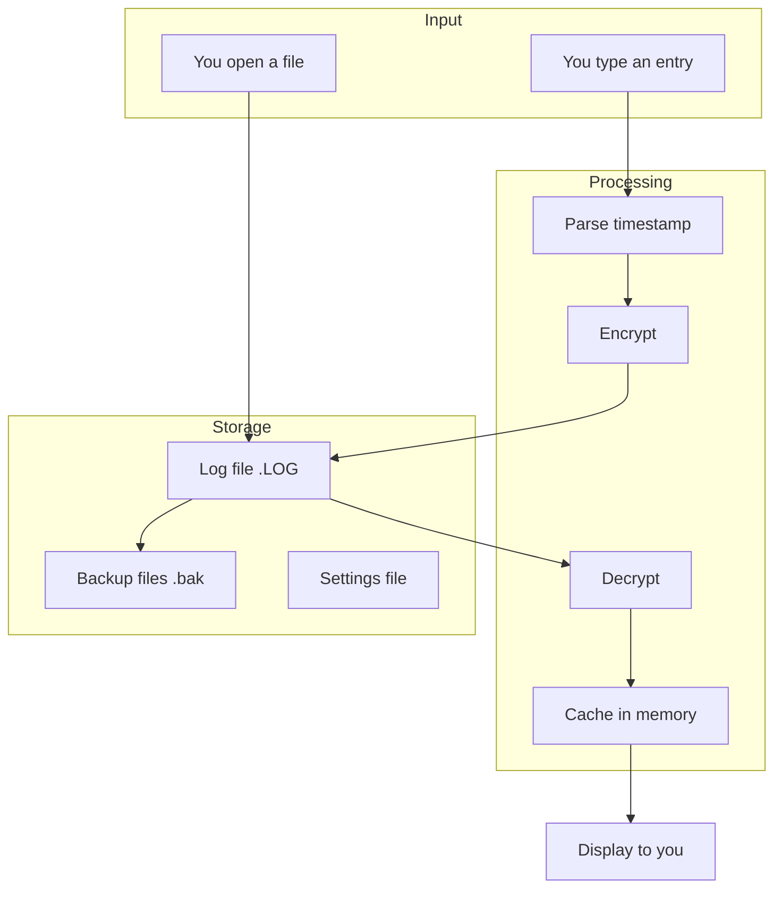

---

## 📈 Performance

| Metric | Value | Notes |
|--------|-------|-------|
| Startup Time | < 1 second | Cold start |
| Memory Usage | ~25 MB | Typical usage |
| File Size Limit | 50 MB | DoS protection |
| Entry Limit | 100,000 | DoS protection |
| JAR Size | 230 KB | Zero dependencies |
| Encryption Time | ~1 second | For key derivation |

---

## 🎓 Oracle Secure Coding Compliance

.LOG-hog follows [Oracle's Secure Coding Guidelines for Java SE](https://www.oracle.com/java/technologies/javase/seccodeguide.html):

| Guideline | Implementation |
|-----------|---------------|
| Purge sensitive info from exceptions | Generic error messages shown to users |
| Resource exhaustion prevention | 50MB file limit, 100k entry limit |
| Make static fields final | Immutable configuration |
| Defensive copies of mutable objects | Salt/key arrays cloned before return |
| Use SecureRandom | All randomness is cryptographic |
| No Java serialization | Eliminates entire attack class |

---

## 🤝 Contributing

### Code Style
- Use clear, descriptive variable names
- Comment complex logic
- Follow existing patterns
- Write tests for new features
- Never log passwords or keys

### Security Rules
- Always clear sensitive data from memory
- Validate all user inputs
- Use SecureRandom (never java.util.Random for security)
- Defensive copies for mutable returns

---

## 📚 Glossary

| Term | Definition |
|------|------------|
| **AES** | Advanced Encryption Standard - the encryption algorithm |
| **GCM** | Galois/Counter Mode - provides integrity verification |
| **PBKDF2** | Password-Based Key Derivation Function 2 |
| **IV** | Initialization Vector - random starting point |
| **Salt** | Random data added to password before hashing |
| **Swing** | Java's built-in GUI framework |
| **JDK** | Java Development Kit |
| **DoS** | Denial of Service - attack that overwhelms resources |
| **Singleton** | Design pattern ensuring only one instance |
| **Facade** | Design pattern that hides complexity |
| **FileLock** | Java mechanism for exclusive file access |

---

## 🔗 Related Documentation

- [encryption.md](src/encryption.md) - Detailed security documentation
- [help.md](src/help.md) - User guide
- [CHANGELOG.md](CHANGELOG.md) - Version history
- [README.md](README.md) - Project overview

---

*Architecture document v2.0 - April 2026*
