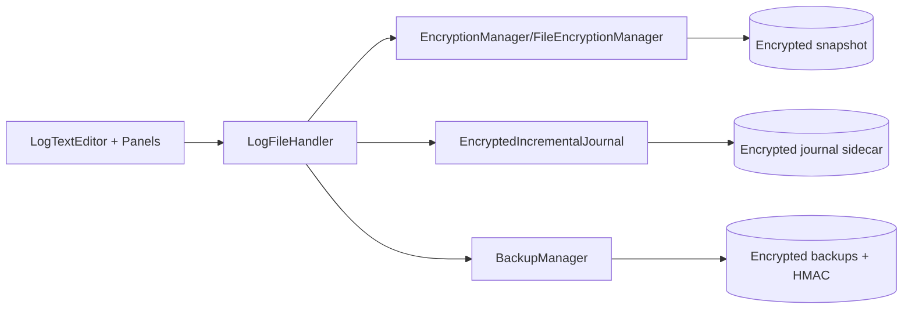
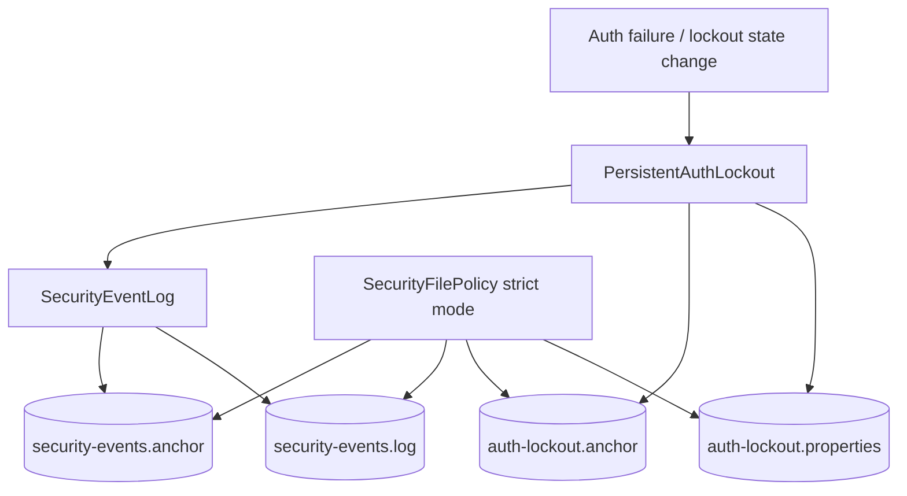
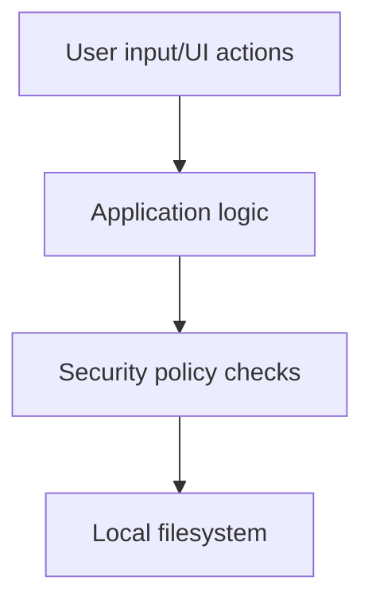

# .LOG-hog Architecture

Short architecture snapshot aligned with current code.

## Core Modules

* UI: `gui/*`, `main/LogTextEditor.java`
* File and entry handling: `filehandling/*`
* Encryption: `encryption/*`
* Security policy/helpers: `security/*`
* Backup and integrity: `main/BackupManager.java`

## Runtime Flow

```mermaid
flowchart LR
    UI[LogTextEditor + Panels] --> FH[LogFileHandler]
    FH --> ENC[EncryptionManager/FileEncryptionManager]
    FH --> JRN[EncryptedIncrementalJournal]
    FH --> BK[BackupManager]
    ENC --> FS[(Encrypted snapshot)]
    JRN --> FSJ[(Encrypted journal sidecar)]
    BK --> BFS[(Encrypted backups + HMAC)]
```

## Security-Critical Design

* Encrypted-only storage path (plaintext mode removed)
* AES-GCM + PBKDF2 derived keys
* Incremental encrypted journal writes, compacted on lock/threshold
* Numbered backup integrity via HMAC
* Persistent lockout with fail-closed tamper/rollback handling
* Tamper-evident security event log (sequence + hash-chain + anchored metadata)
* Link/file open checks and centralized security path policy gates
* Strict owner-only permission enforcement for security-critical artifacts

## Security Persistence Flow

```mermaid
flowchart TD
    AUTH[Auth failure / lockout state change] --> LOCK[PersistentAuthLockout]
    LOCK --> STATE[(auth-lockout.properties)]
    LOCK --> ANCHOR[(auth-lockout.anchor)]
    LOCK --> EVT[SecurityEventLog]
    EVT --> ELOG[(security-events.log)]
    EVT --> EANCH[(security-events.anchor)]
    POLICY[SecurityFilePolicy strict mode] --> STATE
    POLICY --> ANCHOR
    POLICY --> ELOG
    POLICY --> EANCH
```

## Trust Boundaries

```mermaid
flowchart TD
    USER[User input/UI actions] --> APP[Application logic]
    APP --> POLICY[Security policy checks]
    POLICY --> DISK[Local filesystem]
```

## Scope / Non-Goals

* Protects local data at rest and against offline tampering/access
* Does not protect against malware, keyloggers, or a fully compromised host

