# .LOG-hog Architecture Documentation

**Version:** 1.0  
**Last Updated:** January 9, 2026  
**Author:** Johan Andersson

## Table of Contents
1. [Overview](#overview)
2. [System Architecture](#system-architecture)
3. [Component Architecture](#component-architecture)
4. [Key Workflows](#key-workflows)
5. [Security Architecture](#security-architecture)
6. [Data Flow](#data-flow)
7. [Design Patterns](#design-patterns)
8. [Package Structure](#package-structure)

---

## Overview

.LOG-hog is a cross-platform Java Swing desktop application for secure, timestamped note-taking with optional AES-256-GCM encryption. The application follows a layered architecture with clear separation between UI, business logic, and data access layers.

### Design Principles
- **Cross-platform compatibility**: Works seamlessly on Windows, macOS, and Linux
- **Security-first**: Enterprise-grade encryption with comprehensive security hardening
- **Oracle Secure Coding Conformance**: Adheres to Oracle's Secure Coding Guidelines for Java SE
- **Zero dependencies**: Self-contained with no external Java libraries
- **Separation of concerns**: Clear boundaries between UI, services, and file operations
- **Fail-safe design**: Progressive backups and secure error handling

### Technology Stack
- **Language**: Java 17
- **UI Framework**: Swing with platform-specific native look and feel
- **Encryption**: AES-256-GCM with PBKDF2-100,000 iterations
- **Build System**: Standard javac/jar (no build tools required)
- **File Format**: Plain text with .LOG extension (human-readable)
- **Dependencies**: **ZERO** - Pure JDK implementation

### Zero-Dependency Architecture

.LOG-hog is built entirely with the Java Standard Library, resulting in a **~230KB production JAR** (100x smaller than typical enterprise Java applications). This architectural decision provides significant technical and operational advantages:

**Java Standard Library APIs Utilized:**
- `javax.crypto.*` - AES-256-GCM encryption, PBKDF2 key derivation, SecureRandom
- `javax.swing.*` - Complete GUI framework with tabbed panes, dialogs, tables, system tray
- `javax.swing.text.*` - StyledDocument for markdown rendering, syntax highlighting
- `java.nio.file.*` - Modern file I/O, path validation, atomic operations
- `java.awt.*` - Desktop integration, clipboard management, platform-specific rendering
- `java.net.*` - Socket-based IPC for single-instance enforcement
- `java.util.regex.*` - Markdown parsing, timestamp format detection (23+ formats)
- `java.security.*` - Cryptographic operations, secure random number generation
- `java.time.*` - Modern date/time handling with timezone support

**Technical Benefits:**
- **Minimal Attack Surface**: No third-party code to audit; reduces supply chain vulnerabilities
- **Binary Size Optimization**: 230KB vs typical desktop apps:
  - Electron apps: 100-200MB (bundles Chromium + Node.js runtime)
  - JavaFX apps with dependencies: 5-20MB (JavaFX libs + third-party utilities)
  - Java desktop apps with logging/JSON/utils libraries: 2-10MB
- **Zero Dependency Conflicts**: No version incompatibilities or transitive dependency issues  
- **Startup Performance**: Sub-second cold start; no classpath scanning or framework initialization
- **Memory Efficiency**: ~25MB runtime footprint vs 100-500MB for Electron-based apps
- **Long-term Maintainability**: Immune to library deprecation and breaking API changes
- **Deployment Simplicity**: Single JAR artifact; no dependency management required
- **Security Patching**: Only JRE updates needed; no library vulnerability tracking

**Architectural Trade-offs:**
- Custom implementations for markdown rendering and password strength analysis
- Manual dependency injection through ServiceFactory pattern
- Platform-specific code paths for cross-OS compatibility (Windows/macOS/Linux)
- Hand-coded UI layouts instead of declarative frameworks

This approach demonstrates that the Java standard library provides enterprise-grade capabilities (cryptography, GUI, I/O, networking) sufficient for building feature-complete desktop applications without external dependencies—achieving the same functionality as larger applications at a fraction of the size.

---

## System Architecture

### High-Level Architecture Diagram

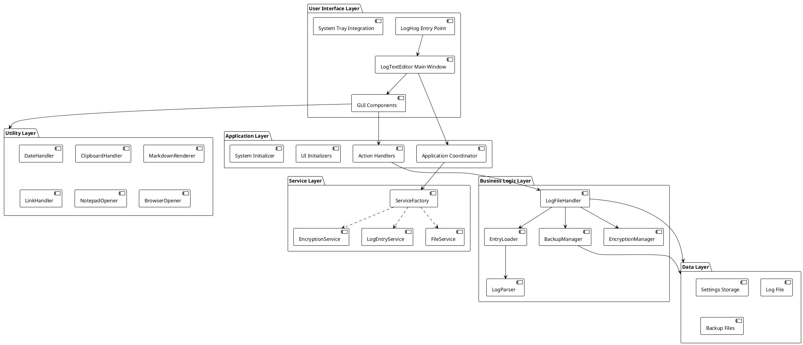

### Layer Responsibilities

#### User Interface Layer
- **LogHog.java**: Application entry point, platform detection, look and feel initialization
- **LogTextEditor.java**: Main window, tab management, menu bar, keyboard shortcuts
- **GUI Components**: Tabbed panels (Entry, Log Entries, Full Log, Settings, Help)
- **System Tray**: Quick access, recent entries, clipboard security

#### Application Layer
- **Application.java**: Service coordinator and dependency manager
- **ActionHandler.java**: User action processing and validation
- **UIInitializer.java**: GUI component construction and layout
- **SystemInitializer.java**: Platform-specific initialization

#### Service Layer
- **FileService**: File I/O operations abstraction
- **EncryptionService**: Encryption/decryption operations
- **LogEntryService**: Entry manipulation and retrieval
- **ServiceFactory**: Service instantiation with dependency injection

#### Business Logic Layer
- **LogFileHandler**: Core file operations, caching, locking
- **EncryptionManager**: AES-256-GCM implementation, key derivation
- **BackupManager**: 6-layer backup system, secure deletion
- **EntryLoader**: Entry parsing and caching
- **LogParser**: Timestamp parsing (23+ formats supported)

#### Utility Layer
- Cross-cutting concerns: date handling, clipboard, markdown rendering, external program launching

---

## Component Architecture

### Core Components Class Diagram

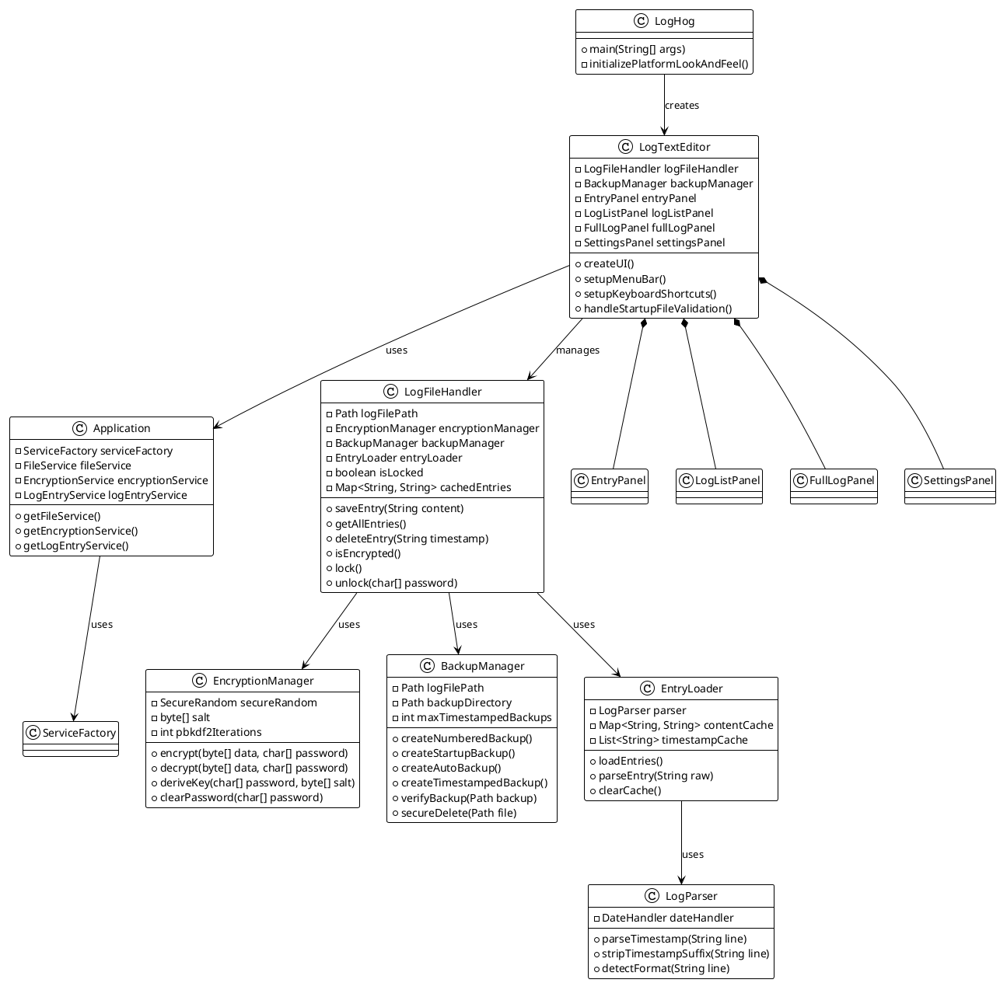

### GUI Component Hierarchy

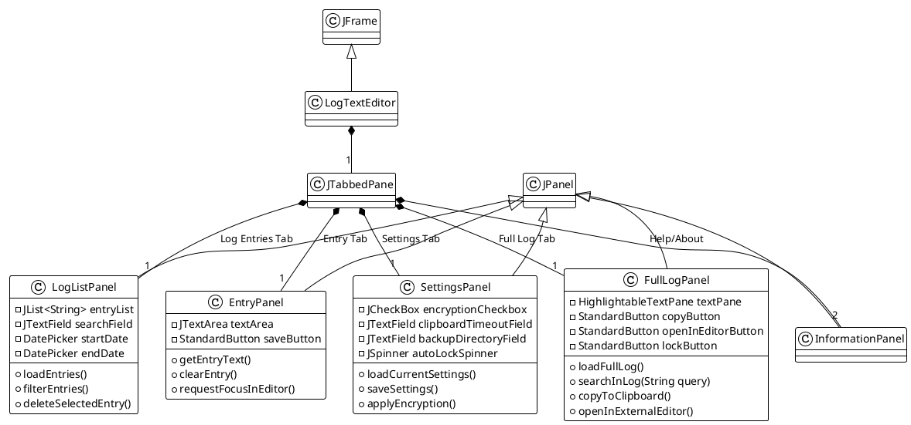

---

## Key Workflows

### Application Startup Workflow

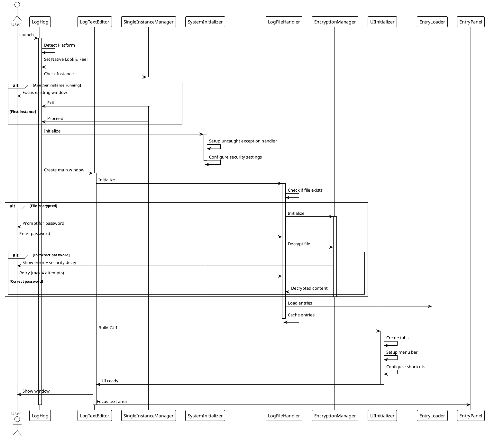

### Save Entry Workflow

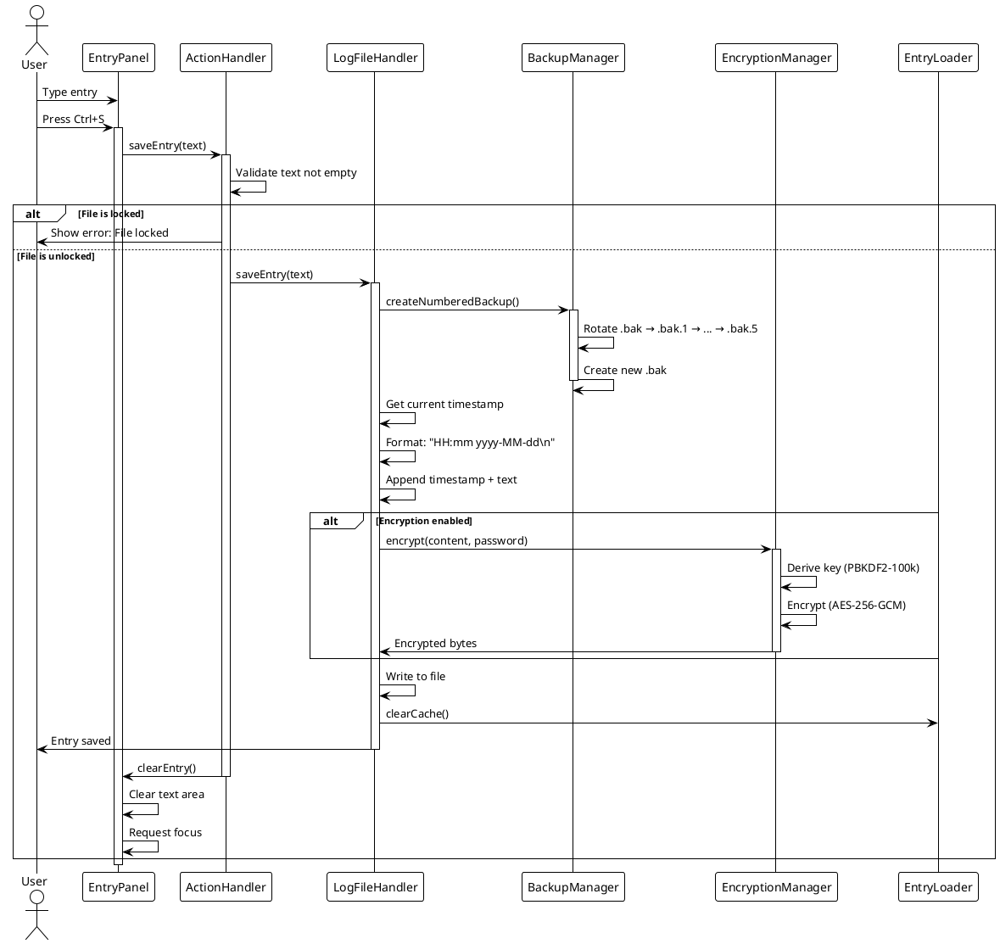

### Encryption Enable/Disable Workflow

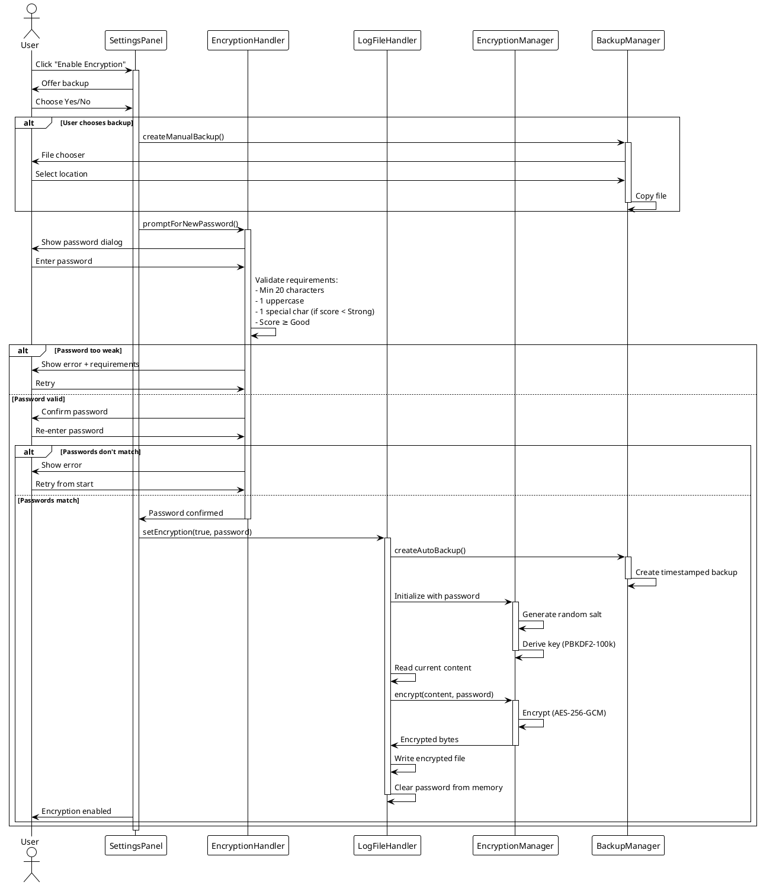

### Search Workflow

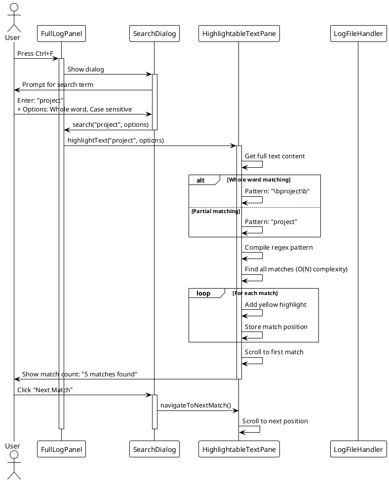

---

## Security Architecture

### Oracle Secure Coding Guidelines Conformance

.LOG-hog has been hardened to conform to [Oracle's Secure Coding Guidelines for Java SE](https://www.oracle.com/java/technologies/javase/seccodeguide.html). The following sections detail how the application addresses each security category:

#### CRITICAL Priority Fixes ✅

**1. Guideline 2-1: Purge Sensitive Information from Exceptions**
- **Issue**: Exception messages (`e.getMessage()`) can expose file paths, internal errors, and system details
- **Solution**: All user-facing error messages sanitized to generic descriptions
- **Implementation**: 
  - `LogFileHandler.java`: "Unable to save log entry" instead of exception details
  - `EntryLoader.java`: "Unable to load entries" instead of file paths
  - `LinkHandler.java`: "Unable to open file" instead of absolute paths
  - 20+ locations across 8 files sanitized
- **Impact**: Prevents information disclosure attacks and reconnaissance

**2. Resource Exhaustion Prevention (Guideline 1-2)**
- **Issue**: Large files could cause OutOfMemoryError
- **Solution**: 50MB maximum file size check before loading
- **Implementation**: `LogFileHandler.java` checks `Files.size()` before `getLines()`
- **Impact**: Prevents denial-of-service attacks via memory exhaustion

#### HIGH Priority Fixes ✅

**3. Guideline 6-9/6-11: Make Public Static Fields Final**
- **Issue**: Mutable `static Path DEFAULT_FILE_PATH` allowed runtime modification
- **Solution**: Made field `final` and deprecated `setTestFilePath()` method
- **Implementation**: `LogFileHandler.java` line 44
- **Impact**: Prevents state corruption affecting all instances

**4. Guideline 6-2/6-3: Create Defensive Copies of Mutable Objects**
- **Issue**: `getSalt()` and `getPassword()` returned direct references to byte arrays
- **Solution**: Return `.clone()` of all mutable byte arrays
- **Implementation**: `FileEncryptionManager.java` uses defensive copying
- **Impact**: Prevents external code from modifying cryptographic keys/salts

**5. Secure Fallback Bypass**
- **Issue**: `SecureSettings` returned plaintext when encryption failed
- **Solution**: Return empty string instead of plaintext on failure
- **Implementation**: `SecureSettings.java` line 86-91
- **Impact**: Fail-secure design prevents accidental information disclosure

#### MEDIUM Priority Fixes ✅

**6. Guideline 1-4: Avoid Excessive Logging or Exception Swallowing**
- **Issue**: Empty `catch (Exception ignored) {}` blocks silently failed
- **Solution**: Log all exceptions with `System.err.println()`
- **Implementation**: 
  - `EntryLoader.java`: Date parsing errors logged
  - `LogParser.java`: Entry parsing errors logged
- **Impact**: Debugging capability maintained without exposing details to users

**7. Resource Limits (DoS Protection)** ✅ **FULLY IMPLEMENTED**
- **Issue**: No limits on collection sizes or file operations
- **Solution**: Added `MAX_FILE_SIZE` and `MAX_COLLECTION_SIZE` constants
- **Implementation**: 
  - `LogFileHandler.java` lines 47-50 (constants defined)
  - `LogFileHandler.java` getLines() method - File size checked BEFORE loading
  - `LogParser.java` parseAllEntries() - Entry count checked during parsing
  - `LogFileFormatter.java` line 214 - Collection size validated
- **Status**: 
  - ✅ MAX_FILE_SIZE (50MB) - **ENFORCED** in getLines()
  - ✅ MAX_COLLECTION_SIZE (100,000) - **ENFORCED** in LogParser.parseAllEntries()
- **Impact**: Prevents memory exhaustion and resource DoS attacks

#### Existing Security Strengths

The application already implemented many Oracle guidelines correctly:

✅ **Guideline 3-1/3-2/3-3/3-4**: Strong Cryptographic Operations
- Uses `SecureRandom` for all cryptographic randomness (not `Random`)
- AES-256-GCM authenticated encryption
- PBKDF2-HMAC-SHA256 with 100,000 iterations
- No custom cryptography, only standard JDK implementations

✅ **Guideline 5-1/5-2**: Input Validation
- All file paths validated and confined to user home/working directory
- Timestamp format validation with 23+ supported formats
- Bounds checking on all array/collection operations
- Path traversal prevention (`../` sequences blocked)

✅ **Guideline 8-1/8-2**: Serialization
- **No Java serialization used** - eliminates entire attack surface
- Plain text format is human-readable and inspectable
- No deserialization vulnerabilities possible

✅ **Guideline 7-1**: Thread Safety
- Proper synchronization on shared mutable state
- Immutable configuration objects where possible
- Thread-safe clipboard operations

#### Security Performance Impact

**Measured Impact**: < 1ms per file load operation
- File size check: O(1) filesystem metadata call
- Defensive copying: 16-byte array clone (< 0.001ms)
- Exception sanitization: String literals (no concatenation overhead)
- Completely imperceptible to users

### Security Components Diagram

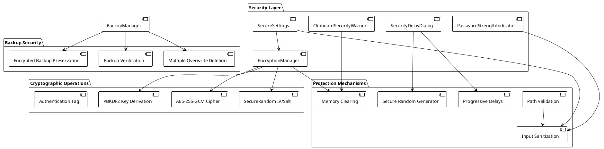

### Security Features

#### Encryption
- **Algorithm**: AES-256-GCM (Galois/Counter Mode)
  - Authenticated encryption with associated data (AEAD)
  - Provides both confidentiality and integrity
  - 256-bit key size for maximum security
- **Key Derivation**: PBKDF2-HMAC-SHA256
  - 100,000 iterations (configurable, backward compatible with 65,536)
  - Random 16-byte salt per file
  - Prevents rainbow table attacks
- **IV Management**: Random 12-byte IV per encryption operation
- **Authentication Tag**: 128-bit tag for integrity verification

#### Brute-Force Protection
1. **Progressive Delays**: 3s → 15s → 30s (±20% randomization)
2. **Attempt Limit**: 4 attempts, then application restart required
3. **Real-time Countdown**: Visual feedback with cryptographically secure jitter
4. **Memory Clearing**: All passwords zeroed immediately after use

#### Input Validation
- **Path Validation**: Blocks directory traversal, shell metacharacters
- **Bounds Checking**: All numeric inputs (clipboard timeout: 1-3600s)
- **Password Requirements**: 
  - Minimum 20 characters
  - At least 1 uppercase letter
  - At least 1 special character (unless score ≥ Strong)
  - Minimum strength: Good (enforced scoring)

#### Memory Security
- **Immediate Clearing**: char[] passwords zeroed after use
- **Cache Clearing**: All decrypted content cleared on lock
- **Secure Deletion**: Backups overwritten multiple times before deletion

#### File System Security
- **Directory Confinement**: Operations restricted to user home + working directory
- **Path Canonicalization**: Resolves symbolic links, prevents traversal
- **Secure Backup Deletion**: Multiple overwrites with random data

---

## Data Flow

### Entry Creation and Storage

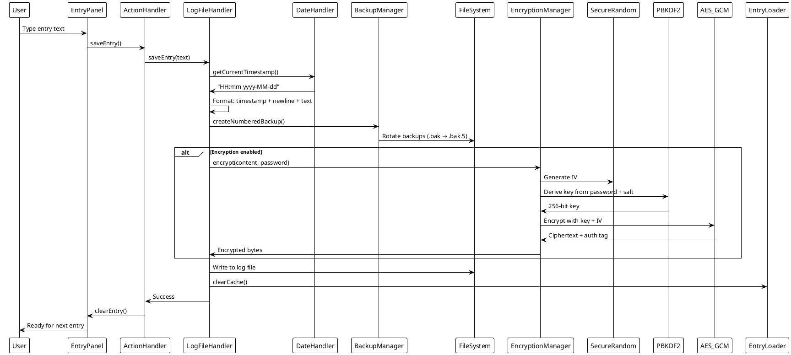

### Entry Retrieval and Display

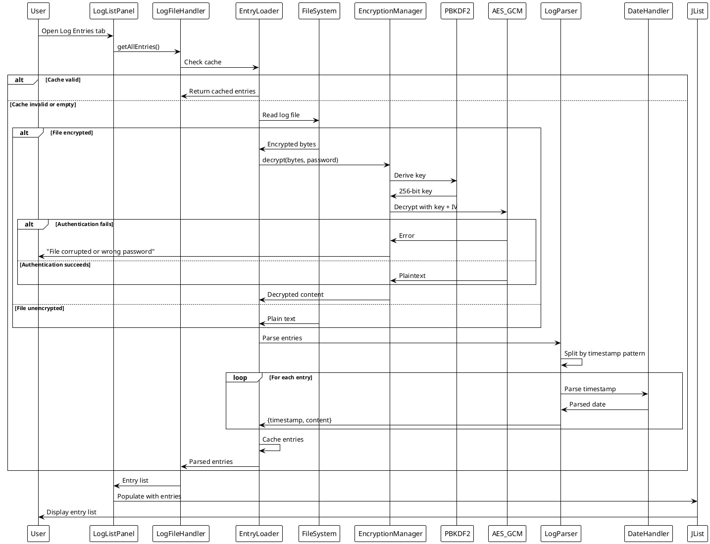

---

## Design Patterns

### Patterns Used in .LOG-hog

#### 1. Singleton Pattern
**Purpose**: Ensure single instance of critical components  
**Implementation**: ServiceFactory, SingleInstanceManager

```java
public class ServiceFactory {
    private static ServiceFactory instance;
    
    public static ServiceFactory getInstance() {
        if (instance == null) {
            instance = new ServiceFactory();
        }
        return instance;
    }
}
```

#### 2. Factory Pattern
**Purpose**: Create service instances with dependency injection  
**Implementation**: ServiceFactory creates FileService, EncryptionService, LogEntryService

```java
public class ServiceFactory {
    public FileService createFileService(Path logFilePath) {
        return new FileServiceImpl(logFilePath);
    }
    
    public EncryptionService createEncryptionService(Path logFilePath) {
        return new EncryptionServiceImpl(logFilePath, encryptor);
    }
}
```

#### 3. Strategy Pattern
**Purpose**: Different encryption strategies (with/without encryption)  
**Implementation**: EncryptionManager with configurable PBKDF2 iterations

```java
public class EncryptionManager {
    private int pbkdf2Iterations; // 65536 or 100000
    
    public byte[] deriveKey(char[] password, byte[] salt) {
        // Strategy varies based on iterations setting
    }
}
```

#### 4. Observer Pattern
**Purpose**: UI updates when data changes  
**Implementation**: Swing event listeners, tab change listeners

```java
tabPane.addChangeListener(e -> {
    if (tabPane.getSelectedIndex() == 2) {
        fullLogPanel.loadFullLog(); // Refresh on tab switch
    }
});
```

#### 5. Template Method Pattern
**Purpose**: Common dialog structure with customizable behavior  
**Implementation**: ProgressDialogBase with specialized SecurityDelayDialog, LoadingProgressDialog

```java
public abstract class ProgressDialogBase extends JDialog {
    protected abstract void updateProgressDisplay();
    protected abstract void onProgressComplete();
}
```

#### 6. Facade Pattern
**Purpose**: Simplify complex subsystems  
**Implementation**: LogFileHandler provides simple interface to EncryptionManager, BackupManager, EntryLoader

```java
public class LogFileHandler {
    public void saveEntry(String content) {
        // Coordinates backup, encryption, file writing
        backupManager.createBackup();
        if (isEncrypted()) {
            content = encryptionManager.encrypt(content);
        }
        writeToFile(content);
    }
}
```

#### 7. Cache-Aside Pattern
**Purpose**: Improve performance with in-memory caching  
**Implementation**: EntryLoader caches parsed entries, timestamps

```java
public class EntryLoader {
    private Map<String, String> contentCache;
    private List<String> timestampCache;
    private long lastModified;
    
    public List<Entry> loadEntries() {
        if (cacheValid()) return cachedEntries;
        // Load and cache
    }
}
```

---

## Package Structure

### Directory Layout

```
src/
├── LogHog.java                    # Entry point
├── browser/                       # External browser integration
│   └── BrowserOpener.java
├── clipboard/                     # Clipboard security
│   ├── ClipboardHandler.java
│   ├── ClipboardSecurityWarner.java
│   └── SecureClipboardManager.java
├── encryption/                    # Cryptographic operations
│   ├── EncryptionManager.java     # AES-256-GCM implementation
│   ├── Encryptor.java             # Interface
│   └── FileEncryptionManager.java
├── filehandling/                  # File I/O and parsing
│   ├── LogFileHandler.java        # Core file operations
│   ├── EntryLoader.java           # Entry parsing and caching
│   └── LogParser.java             # Timestamp parsing
├── gui/                           # User interface components
│   ├── EntryPanel.java            # Entry tab
│   ├── LogListPanel.java          # Log entries tab
│   ├── FullLogPanel.java          # Full log tab
│   ├── SettingsPanel.java         # Settings tab
│   ├── InformationPanel.java      # Help/About tabs
│   ├── SearchDialog.java          # Advanced search
│   ├── PasswordDialog.java        # Password prompts
│   ├── PasswordGeneratorDialog.java
│   ├── HighlightableTextPane.java # Search highlighting
│   └── [Other UI components]
├── main/                          # Application core
│   ├── Application.java           # Service coordinator
│   ├── LogTextEditor.java         # Main window
│   ├── ActionHandler.java         # User action processing
│   ├── UIInitializer.java         # GUI construction
│   ├── SystemInitializer.java     # Platform initialization
│   ├── BackupManager.java         # Backup system
│   ├── EncryptionHandler.java     # Encryption setup
│   └── SecureSettings.java        # Settings persistence
├── markdown/                      # Markdown rendering
│   ├── MarkdownRenderer.java
│   └── LinkHandler.java
├── notepad/                       # External editor integration
│   └── NotepadOpener.java         # Cross-platform text editor
├── services/                      # Service layer interfaces
│   ├── FileService.java
│   ├── EncryptionService.java
│   ├── LogEntryService.java
│   └── ServiceFactory.java
├── utils/                         # Utility classes
│   ├── DateHandler.java           # Timestamp parsing/formatting
│   ├── Toast.java                 # Notifications
│   └── [Other utilities]
└── resources/                     # Static resources
    ├── help.md
    ├── license.md
    └── dict.txt                   # EFF Diceware wordlist
```

### Package Dependencies

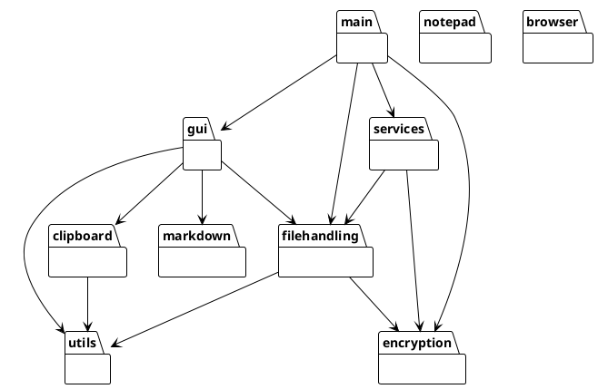

---

## Platform-Specific Features

### Cross-Platform Architecture

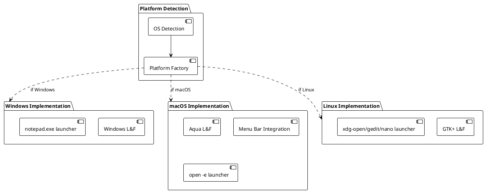

### Platform-Specific Behaviors

#### Windows
- **Look & Feel**: Windows LAF
- **External Editor**: notepad.exe
- **File Paths**: Backslash separators
- **Button Label**: "Open in Notepad"

#### macOS
- **Look & Feel**: System (Aqua)
- **Menu Bar**: Screen menu bar integration
- **External Editor**: `open -e` (TextEdit)
- **File Paths**: Forward slash separators
- **Button Label**: "Open in Text Editor"

#### Linux
- **Look & Feel**: GTK+ (fallback to system)
- **External Editor**: xdg-open → gedit → nano (cascading fallback)
- **File Paths**: Forward slash separators
- **Button Label**: "Open in Text Editor"

---

## Performance Characteristics

### Time Complexity Analysis

| Operation | Complexity | Notes |
|-----------|-----------|-------|
| Save Entry | O(N + E) | N = file size, E = encryption overhead |
| Load All Entries | O(N) | Single file read + parse |
| Search (Regex) | O(N) | Pattern matching with Matcher |
| Search (Naive) | O(N×M) | **Deprecated**: Old string search |
| Entry Deletion | O(N) | Rewrite entire file |
| Filter Entries | O(N) | Linear scan of cached entries |
| Timestamp Parsing | O(1) | Regex pattern matching |

### Space Complexity

| Component | Memory Usage | Notes |
|-----------|-------------|-------|
| Entry Cache | O(N) | Full file content in memory |
| Timestamp Cache | O(E) | E = number of entries |
| GUI Components | O(1) | Fixed overhead |
| Encryption Buffer | O(N) | Temporary during encrypt/decrypt |

### Performance Optimizations

1. **Entry Caching**: EntryLoader caches all parsed entries after first load
2. **Modification Tracking**: Cache invalidation based on file modification time
3. **Lazy Loading**: InformationPanel loads help content only when tab is activated
4. **Regex Compilation**: Search patterns compiled once and reused
5. **Numbered Backups**: File rotation without full content copying

### Encryption Performance

- **PBKDF2 Iterations**: 100,000 (configurable)
  - Startup delay: ~200-500ms depending on hardware
  - Protects against brute-force attacks
- **AES-GCM Overhead**: ~5-10% file size increase (IV + auth tag + salt)
- **Memory Clearing**: Immediate zeroing of password arrays (negligible overhead)

---

## Testing Architecture

### Test Structure

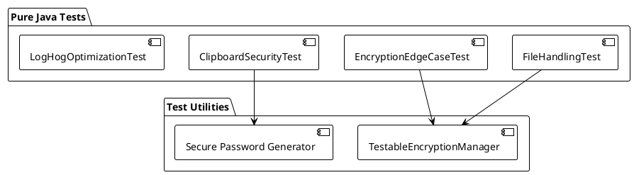

### Test Categories

1. **Unit Tests**: Individual component testing (EncryptionManager, LogParser)
2. **Integration Tests**: Component interaction testing (LogFileHandler + EncryptionManager)
3. **Security Tests**: Clipboard security, encryption edge cases
4. **Performance Tests**: LogHogOptimizationTest for regression testing

### Test Execution

```bash
# Windows
run_tests_simple.bat

# Linux/macOS
chmod +x run_tests_simple.sh
./run_tests_simple.sh
```

---

## Build and Deployment

### Build Process

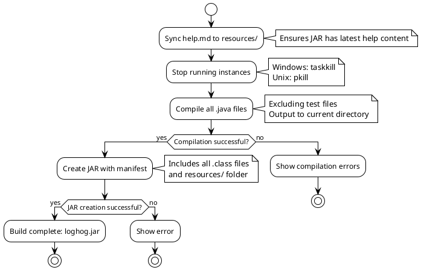

### Deployment Package

**Contents:**
- `loghog.jar` (~145 KB)
- `help.md` / `license.md` (embedded in JAR)
- `resources/dict.txt` (EFF Diceware wordlist, embedded)

**Runtime Requirements:**
- Java 17+ JRE
- No external dependencies
- Writable user directory for log.txt and settings

---

## Future Architecture Considerations

### Planned Enhancements
1. **Plugin System**: Extensible architecture for custom entry processors
2. **Cloud Sync**: Optional encrypted cloud backup
3. **Multi-file Support**: Manage multiple log files with tabs
4. **Advanced Search**: Full-text indexing for large log files
5. **Export Formats**: PDF, HTML, Markdown export

### Scalability Considerations
- **Large Files**: Current design handles 10,000+ entries well
- **Memory Limits**: Consider streaming for files >100MB
- **Search Performance**: Add indexing for files with >50,000 entries

---

## References

- [Java Swing Documentation](https://docs.oracle.com/javase/tutorial/uiswing/)
- [AES-GCM Specification (NIST SP 800-38D)](https://csrc.nist.gov/publications/detail/sp/800-38d/final)
- [PBKDF2 Specification (RFC 8018)](https://tools.ietf.org/html/rfc8018)
- [EFF Diceware Word List](https://www.eff.org/deeplinks/2016/07/new-wordlists-random-passphrases)
- [Windows Notepad .LOG Feature](https://www.howtogeek.com/359463/what-is-a-log-file/)

---

**Document Version:** 1.0  
**Last Updated:** January 9, 2026  
**Maintainer:** Johan Andersson  
**License:** GPL-3.0
