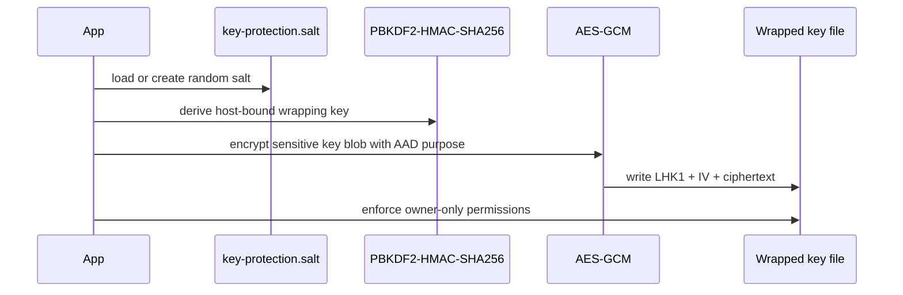

# .LOG-hog Security and Encryption Documentation

This document restores the full encryption documentation and aligns it with the current codebase.

## Security Review Status

- Critical cryptography regressions: not identified in current implementation.
- Primary hardening updates reflected in this revision:
  - sensitive local key files are now protected at rest with host-bound AES-GCM wrapping,
  - settings persistence is unified to a single canonical path,
  - user-facing error messages are sanitized in key UI paths.

## Overview

.LOG-hog protects local logs and notes with authenticated encryption, integrity-checked backups, tamper-evident lockout state, and security event anchoring.

It is designed for local data-at-rest protection on a trusted machine. It is not designed to defend against active malware, keyloggers, or a fully compromised OS account.

## Threat Model

Designed to protect against:

- offline theft/copying of log and backup files,
- accidental exposure through weak filesystem defaults,
- tampering/rollback of authentication lockout state,
- silent corruption of backups.

Not designed to protect against:

- host compromise during runtime,
- memory scraping with elevated local privileges,
- clipboard interception by malware,
- social engineering/password disclosure.

## Cryptography

### Core profile

- Encryption: AES-256-GCM (AES/GCM/NoPadding)
- KDF: PBKDF2WithHmacSHA256
- PBKDF2 iterations: 600,000
- AES key size: 256-bit
- GCM IV length: 12 bytes
- GCM tag length: 16 bytes

### File format

Encrypted file header format:

MAGIC(4) | VERSION(1) | SALT_LEN(1) | SALT | IV_LEN(1) | IV | CIPHERTEXT

Salt is embedded in the encrypted file header and can be recovered for disaster-recovery decryption with the user password.

### Security properties

- Authenticated encryption (confidentiality + integrity) with GCM
- Unique random IV per encryption operation
- Random per-file salt for KDF hardening
- Constant-time integrity comparisons in critical verification paths

## Settings and Metadata Storage

### Canonical settings path

Settings are now unified at:

- ~/.loghog/settings.properties

Legacy loghog_settings.properties is treated as migration input when present.

### Sensitive key material at rest

Security key files (for lockout HMAC and security-event signing/HMAC) are protected with host-bound AES-GCM wrapping instead of raw plaintext/base64 storage.

Red-team caveat: this host binding is a hardening layer, not a hardware-backed secret store. If an attacker can recover host/user fingerprint inputs and key-protection salt from the same machine image, offline unwrap may still be possible.

Protection flow:

1. derive host wrapping key via PBKDF2-HMAC-SHA256 using host/user fingerprint and app-protected salt,
2. encrypt key blob with AES-GCM + purpose-bound AAD,
3. enforce owner-only permissions on wrapped key artifacts.

## Authentication Lockout Model

Current behavior:

- 3 attempts per session,
- each exhausted session increments failed-session count,
- lockout triggers after 10 failed sessions,
- lockout duration: 30 minutes,
- tamper/missing lockout artifacts fail closed.

Lockout state includes sequence/hash anchor checks to detect rollback attempts.

## Backup and Integrity Model

- Backups preserve encrypted bytes.
- Backup integrity uses HMAC-SHA256 append/verify.
- Lock and backup flows compact encrypted journal into snapshot where needed.
- Secure deletion is best-effort and may not be absolute on SSD wear-leveling devices.

## Security Event Logging

- Security events are chain-anchored with sequence/hash metadata.
- Anchor integrity is checked with HMAC and Ed25519 signature verification.
- Signing private key and HMAC key are stored as protected key blobs.

## Memory Handling

- Sensitive byte arrays are zeroized after use where practical.
- Password handling uses mutable arrays where possible.
- Runtime plaintext exposure remains possible in normal JVM process memory during active use.

## Data Flow Diagram

```mermaid
flowchart LR
    PW[Password char[]] --> KDF[PBKDF2-HMAC-SHA256]
    KDF --> ENC[AES-GCM Encrypt or Decrypt]
    ENC --> SNAP[(Encrypted snapshot file)]
    ENC --> JOUR[(Encrypted journal sidecar)]

    SNAP --> BKP[Backup Manager]
    JOUR --> BKP
    BKP --> HMAC[HMAC append and verify]
    HMAC --> BFILE[(Encrypted backup artifact)]

    AUTH[Auth attempts] --> LOCK[PersistentAuthLockout]
    LOCK --> LSTATE[(auth-lockout.properties)]
    LOCK --> LKEY[(auth-lockout.key wrapped)]
    LOCK --> LANCH[(auth-lockout.anchor)]

    SEVT[Security events] --> SELOG[SecurityEventLog]
    SELOG --> ELOG[(security-events.log)]
    SELOG --> EANCH[(security-events.anchor)]
    SELOG --> EKEY[(security-events.key wrapped)]
    SELOG --> EPRIV[(signing-private.key wrapped)]
```

## Key Protection Diagram



## Operational Limits

- Host compromise can defeat local-at-rest controls.
- Memory dumps from an unlocked session can expose plaintext UI buffers and live session keys.
- Clipboard security cannot guarantee clearing after forced process termination.
- File-level secure deletion is best-effort on SSD/flash media.

## User Guidance

- Use a strong password (20+ chars recommended).
- Keep full-disk encryption enabled at OS level.
- Lock the app when unattended.
- Keep secure backups and test restore procedures.

## Summary

.LOG-hog currently combines modern authenticated encryption, hardened lockout persistence, tamper-evident event logging, and stronger at-rest handling for local security key artifacts. The design provides strong local protection for personal sensitive data when used on a trusted and hardened host.


