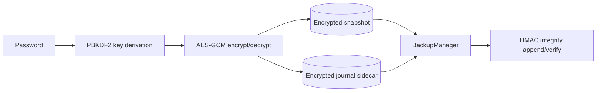

# .LOG-hog Encryption Notes

Concise encryption/security reference aligned with the current code.

## Threat Model

Designed to protect local data at rest and backups against offline access/tamper.

Not designed to protect against malware, keyloggers, or a fully compromised host.

## Crypto Profile

* AES-256-GCM (`AES/GCM/NoPadding`)
* PBKDF2-HMAC-SHA256 (600,000 iterations)
* 12-byte IV, 16-byte tag
* Random per-file salt and per-operation IV

## Storage Model

* Encrypted-only primary snapshot file
* Incremental edits appended to encrypted journal sidecar
* Journal compacted into snapshot on lock/threshold
* Salt embedded in encrypted headers (snapshot + journal)

## Key Security Controls

* No raw password stored in settings
* Sensitive arrays are zeroized where possible
* Persistent auth lockout uses tamper-evident state and fail-closed handling
* Backup integrity uses HMAC-SHA256 with derived backup key material
* Owner-only file-permission hardening is applied best-effort per platform

## Data Flow

## Practical Limits

* Active-session plaintext can exist in process memory due to JVM/string semantics
* Secure deletion is best-effort and not absolute on SSD wear-leveling systems

