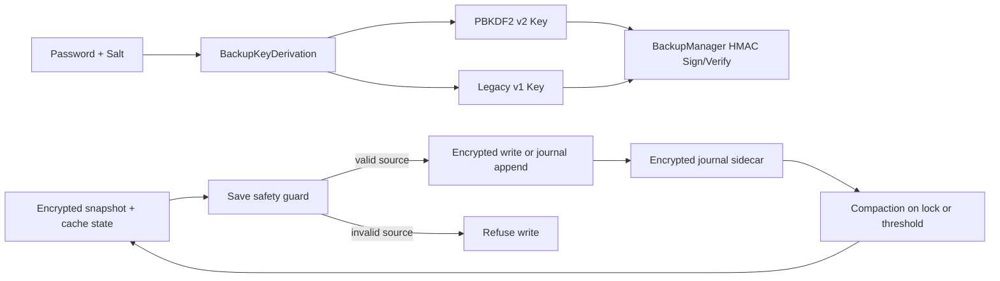

# 🔐 .LOG-hog Security & Encryption Documentation

## Security Review Status (June 2026)

* No critical CWE-class vulnerabilities (e.g., path traversal, command injection, insecure deserialization, hardcoded credentials) were identified during internal code review and static analysis.
* No hardcoded keys or credentials present.
* File and path handling follow secure practices.
* The codebase is regularly analyzed using tools such as SpotBugs / FindSecBugs.

***

## Overview

.LOG-hog provides **secure local encrypted storage for personal logs and notes**, using modern cryptographic standards and secure coding practices.

It is designed to protect sensitive data **at rest on a trusted local machine**, particularly against offline threats such as unauthorized file access or backup extraction.

This document outlines the system’s cryptographic design, architecture, and security controls.

***

## Threat Model (Important)

.LOG-hog is designed to protect against:

* Unauthorized access to stored files (e.g., stolen disk or backups)
* Offline brute-force attacks on encrypted data
* Accidental data exposure through filesystem access

It does **not** protect against:

* Malware or keyloggers on the host system
* Attackers with access to system memory during an active session
* Social engineering or password disclosure

***

## 🔐 Cryptography & Encryption

### Implementation

* **Encryption Algorithm**: AES-256-GCM
* **Key Derivation**: PBKDF2 (HMAC-SHA256)
* **Iterations**: 600,000
* **Key Length**: 256 bits
* **IV Length**: 96 bits
* **Authentication Tag**: 128 bits

***

### Security Properties

* **Authenticated Encryption**  
  AES-GCM ensures both confidentiality and integrity.

* **Unique IV per encryption**  
  Prevents nonce reuse vulnerabilities.

* **Secure Salt Generation**  
  128-bit cryptographically secure random salts.

* **Memory Handling**  
  Sensitive data (passwords, keys) stored in mutable arrays and explicitly cleared (`CryptoUtils.zeroize`) after use.  
  The primary **streaming path** processes plaintext via streams and avoids creating a full plaintext `byte[]` in one allocation; intermediate plaintext byte arrays are zeroized before the method returns.  
  Some helper paths still materialize plaintext as Java `String` objects, which are immutable and cannot be zeroed from memory — this remains a JVM limitation.

* **Session Password Handling**  
  The raw password is not retained for the active session. A derived session key is kept in memory for re-encryption and is cleared on lock or when encryption is disabled.

* **Streaming Decryption**  
  Large files are processed in streams to avoid full in-memory plaintext allocation.

* **File Permissions**  
  Enforced owner-only access where supported (POSIX).  
  Windows fallback uses standard JDK file permission APIs (limited by OS-level ACL behavior).

* **Write Safety Guard**  
  Encrypted save paths refuse writes when the source encrypted file is non-empty but decrypts to empty content,
  preventing silent overwrite in ambiguous/corrupt edge states.

***

### File Format

```
MAGIC(4) | VERSION(1) | SALT-LEN | SALT | IV-LEN | IV | CIPHERTEXT
```

This structured header enables forward compatibility and safe parsing.

The main encrypted snapshot is the canonical file on disk. Incremental edits are first written to a small encrypted journal sidecar, then compacted back into the snapshot on lock or when the journal grows beyond a threshold.

The **salt is embedded in every encrypted snapshot and journal file**. This means the encryption metadata still travels with the encrypted data, but the active state may now consist of the main snapshot plus a journal sidecar while the file is open.

Recovering access requires the encrypted snapshot, the journal sidecar if one exists, and the correct password — the settings file (`loghog_settings.properties`) is not required. If settings are lost or the app is reinstalled, .LOG-hog will automatically extract the salt from the encrypted file headers on next launch and restore the settings file.

***

### Backup Integrity

Backups include an **HMAC-SHA256** for integrity verification.  
The backup signing key now uses a stronger **PBKDF2-HMAC-SHA256 derived key (v2)** from password+salt.
A legacy verifier remains in place for backward compatibility with older backup signatures.
Integrity is verified immediately after backup creation.

***

### Testing

Unit tests cover:

* Header parsing
* Stream-based decryption
* Corrupt and truncated file handling

***

## 🏗️ System Architecture

The encryption system is modular and designed with separation of concerns:

### Core Components

* **EncryptionManager** – orchestrates high-level operations
* **Encryptor** – AES-GCM and key derivation
* **FileEncryptionManager** – file I/O integration
* **EncryptedIncrementalJournal** – incremental encrypted append sidecar and compaction helper
* **CryptoUtils** – shared security primitives (zeroization, comparison, permissions)
* **BackupKeyDerivation** – backup-key derivation policy (v2 + legacy compatibility)



***

### Design Characteristics

* Clear API boundaries and responsibilities
* Dependency injection for testability
* Minimal external dependencies (JDK crypto only)
* Thread-safe operation
* Consistent handling of sensitive data

***

## 🔑 Password Security

### Brute-force Mitigation

* Progressive delays (3s → 15s → 30s)
* Randomized delay variation to reduce predictability
* Maximum attempt limit keeps encrypted content locked without forcing process termination
* Persistent lockout state is retained to resist repeated restart-based guessing

***

### Security Considerations

* High PBKDF2 iteration count slows offline attacks
* Password strength requirements enforced
* Passwords cleared from memory when no longer needed

***

## 💾 Data Protection

### File Security

* Full-file encryption at rest, with incremental appends staged through an encrypted journal sidecar
* AES-GCM authentication prevents undetected tampering
* Lock operation clears sensitive data from memory

***

### Application Behavior

* Single-instance execution
* Input validation for sensitive operations
* Secure error handling
* Always-on auto-lock for inactive sessions

***

## 📋 Clipboard Security

### Features

* Automatic clearing after configurable timeout (always enabled)
* Manual clear controls
* Clipboard clearing on application shutdown

***

### ⚠️ Known Limitation

If the application is terminated unexpectedly (e.g., crash, forced kill):

* Clipboard contents are **not cleared**
* Sensitive data may remain accessible to other processes

**Mitigation:** manually clear clipboard after abnormal termination.

***

## 📊 Attack Surface Summary

### Strong Protection Against

* Offline file access
* Casual brute-force attempts
* Automated guessing attacks
* Data tampering

***

### Limitations

* No protection against system compromise (malware/keyloggers)
* Password remains in memory during active session
* Clipboard exposure on unexpected termination
* Secure deletion is not guaranteed on SSDs

***

## 🔧 Technical Parameters

```java
ALGORITHM = "AES/GCM/NoPadding"
GCM_IV_LENGTH = 12
GCM_TAG_LENGTH = 16
PBKDF2_ITERATIONS = 600000
AES_KEY_LENGTH = 256
```

***

## 🧠 Memory Security Model

* Sensitive arrays zeroized after use
* AES keys exist only during operations
* Raw password not retained after unlock
* Derived session key retained temporarily for usability
* Cleared on lock or shutdown

***

## 🔄 Backup Security

### Features

* Automatic backups on critical operations
* Encrypted backups preserve original state
* Atomic file operations prevent corruption

***

### Secure Deletion

Best-effort 3-pass overwrite:

1. Random data
2. Pattern overwrite
3. Zeroing

**Note:** ineffective against SSD wear-leveling.

***

## ⚙️ Settings

* No passwords or secret keys stored in configuration
* Security metadata and runtime preferences are stored in plaintext configuration

***

## 📏 Standards & Practices

* NIST-recommended algorithms (AES-GCM, PBKDF2)
* OWASP-aligned secure coding practices
* No claim of formal certification (e.g., FIPS validation)

***

## ✅ Summary

.LOG-hog implements **modern, well-established cryptographic techniques** and secure handling practices to protect local data at rest.

It provides a **strong level of security for personal use**, assuming:

* a trusted host system
* a strong user password

For higher-risk scenarios, additional protections (e.g., full-disk encryption, hardened OS environment) are recommended.

***

